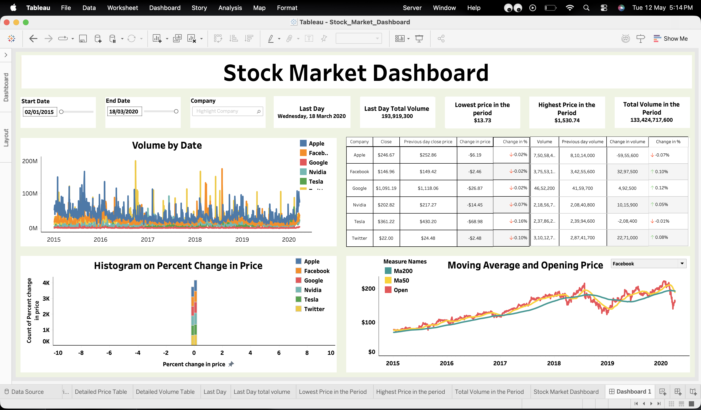
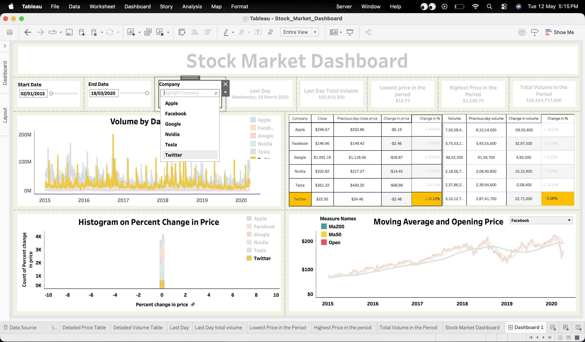
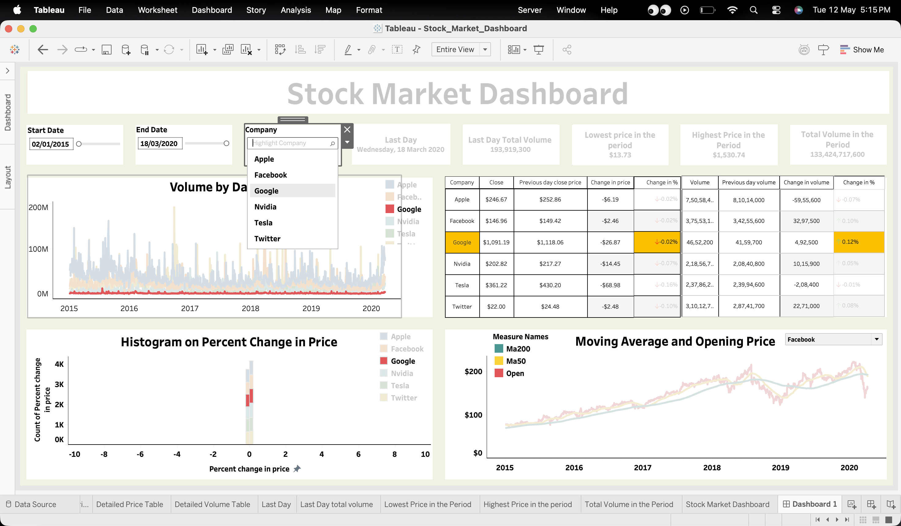
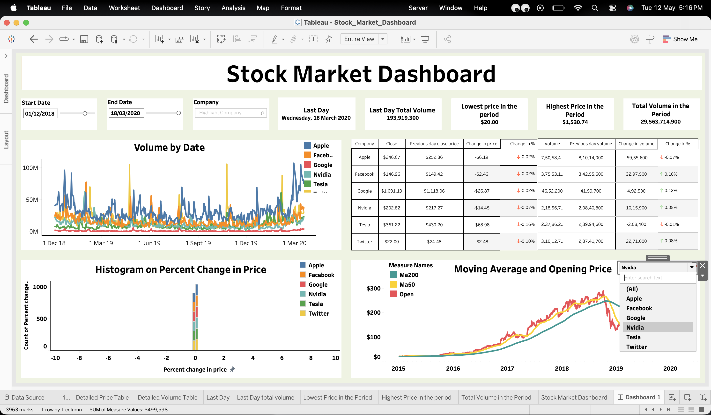
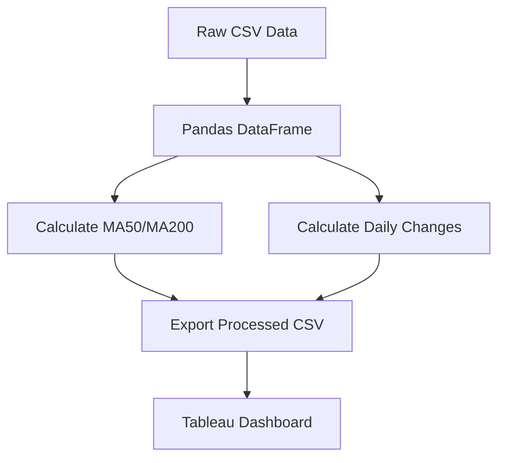

# Stock Market Analysis

<div align="center">


</div>

---

## 📊 Dashboard Screenshots

<div align="center">
  
  
  
  
</div>

---

## 🚀 Overview

This project analyzes historical stock market data for six major technology companies using Python's Pandas library for data manipulation and Tableau for interactive visualization. The analysis includes technical indicators, price trends, and volume analysis.

### 📊 Companies Analyzed

| Company | Ticker | IPO Date |
|---------|--------|----------|
| Apple | AAPL | December 12, 1980 |
| Meta (Facebook) | FB | May 18, 2012 |
| Alphabet (Google) | GOOGL | August 2, 2004 |
| NVIDIA | NVDA | January 22, 1999 |
| Tesla | TSLA | June 29, 2010 |
| Twitter (X) | TWTR | November 7, 2013 |

---

## 📁 Project Structure

```
Stock-Market-Analysis/
├── 📓 Stock_Market_Financial_Analysis.ipynb  # Main analysis notebook
├── 📊 Stock_Market_Dashboard.twb             # Tableau workbook
├── 📊 Stock_Market_Dashboard.twbx            # Packaged Tableau workbook
├── 📈 Apple.csv                              # Apple stock data
├── 📈 Facebook.csv                           # Meta stock data
├── 📈 Google.csv                             # Alphabet stock data
├── 📈 Nvidia.csv                             # NVIDIA stock data
├── 📈 Tesla.csv                              # Tesla stock data
├── 📈 Twitter.csv                            # Twitter stock data
└── 📊 Dashboard/                             # Dashboard screenshots
    ├── dashboard1.png
    ├── dashboard2.png
    ├── dashboard3.png
    └── dashboard4.png
```

---

## 🔧 Technical Features

### Calculated Indicators

```
📈 Moving Averages
├── 50-day Moving Average (MA50)
└── 200-day Moving Average (MA200)

📊 Price Analysis
├── Daily Price Change
├── Percent Price Change
└── Previous Day Close Comparison

📉 Volume Analysis
├── Daily Volume Change
├── Percent Volume Change
└── Previous Day Volume Comparison
```

### Data Transformations



---

## 🎯 Key Insights

### Stock Performance Summary

```
Company      | Date Range     | Key Observation
-------------|----------------|-----------------
Apple        | 1980-2020      | 50x+ growth over 40 years
Meta         | 2012-2020      | High volatility post-IPO
Google       | 2004-2020      | Steady growth trajectory
NVIDIA       | 1999-2020      | GPU boom catalyst
Tesla        | 2010-2020      | Exponential growth phase
Twitter      | 2013-2020      | Post-IPO stabilization
```

---

## 📊 Tableau Dashboard Features

The interactive dashboard includes:

- **Price Trend Visualization**: Interactive time-series charts for each stock
- **Moving Average Crossover Signals**: Visual buy/sell indicators
- **Volume Analysis**: Trading volume trends and patterns
- **Company Comparison**: Side-by-side performance metrics
- **Date Range Filters**: Customizable time periods

[View Live Dashboard](https://public.tableau.com/app/profile/rohan.verma4805/viz/Stock_Market_Dashboard/Dashboard1?publish=yes)

---

## 🚀 Getting Started

### Prerequisites

```bash
pip install pandas jupyter
```

### Running the Analysis

```bash
jupyter notebook Stock_Market_Financial_Analysis.ipynb
```

### Data Source

- [Kaggle Stock Market Dataset](https://www.kaggle.com/datasets/jacksoncrow/stock-market-dataset)

---

## 📈 Sample Code

```python
import pandas as pd

# Load stock data
stocks = ['apple', 'facebook', 'google', 'nvidia', 'tesla', 'twitter']
dfs = [apple, facebook, google, nvidia, tesla, twitter]

# Calculate moving averages
for df in dfs:
    df['MA50'] = df.Close.rolling(50).mean()
    df['MA200'] = df.Close.rolling(200).mean()
```


## 📝 License

This project is for educational purposes. Data sourced from public financial APIs.

---

<div align="center">

⭐ **Star this repository if you find it helpful!**

</div>
